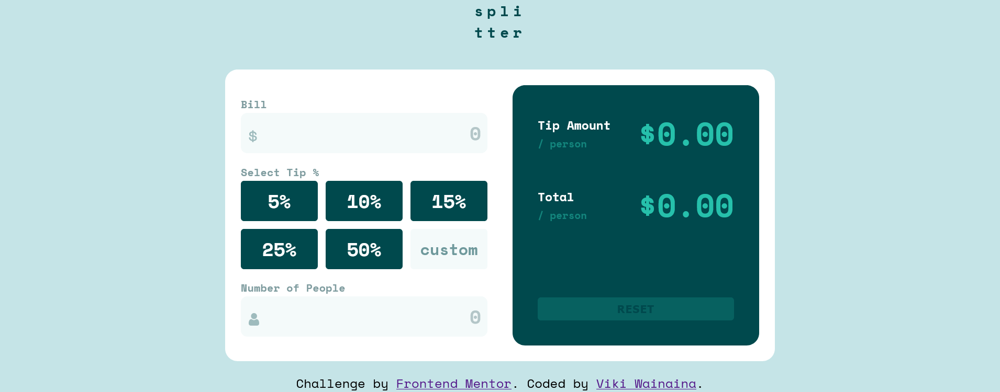

# Frontend Mentor - Tip calculator app

## Welcome! 👋

[Frontend Mentor](https://www.frontendmentor.io) challenges help you improve your coding skills by building realistic projects.

**To do this challenge, you need a basic understanding of HTML, CSS and JavaScript.**

### The challenge

Users should be able to:

- View the optimal layout for the app depending on their device's screen size
- See hover states for all interactive elements on the page
- Calculate the correct tip and total cost of the bill per person

### Built with

- Semantic HTML5 markup
- CSS custom properties
- Flexbox
- CSS Grid

**Have fun building!** 🚀
